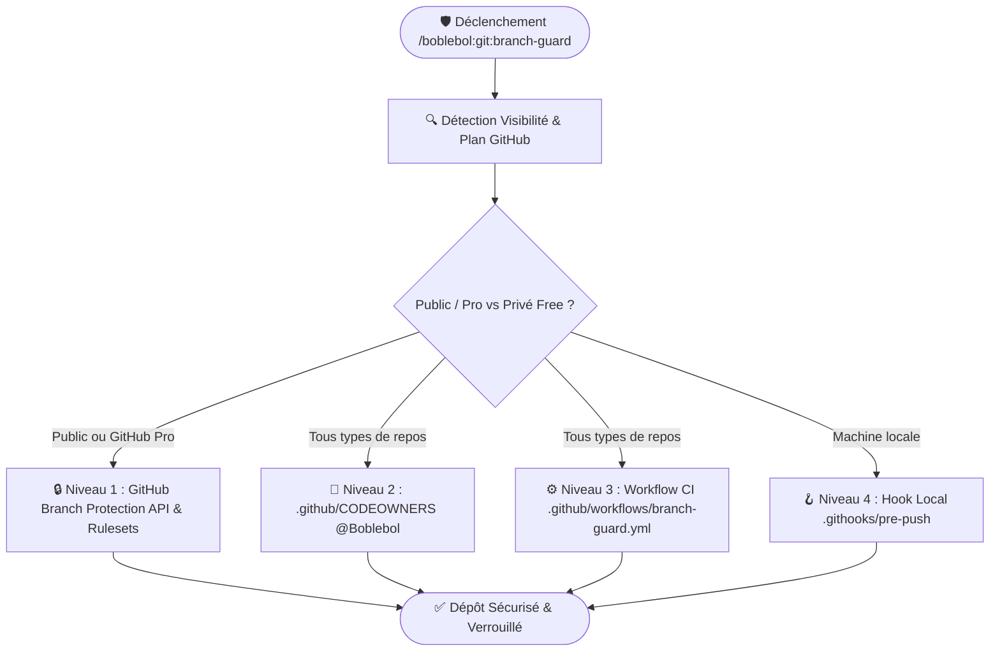

# 🛡️ Skill : Branch Guard & GitHub Security Architect

Ce skill configure la protection absolue de vos branches principales (`main`, `master`, `release/*`) pour garantir que **seul le propriétaire du dépôt (ex: `@Boblebol`) puisse merger, approuver les Pull Requests ou pousser du code**.

---

## 🏗️ Architecture & Niveaux de Protection



---

## 🛡️ Les 4 Niveaux de Protection Implémentés

### 1. 🔒 Niveau 1 : Protection Native GitHub API & Rulesets
*(Actif sur les dépôts publics et les comptes GitHub Pro / Enterprise)*
- **Blocage des pushes directs** sur `main` pour les contributeurs externes.
- **Interdiction des force-pushes** (`allow_force_pushes: false`) et suppressions de branche (`allow_deletions: false`).
- **Revue obligatoire de PR** avec approbation restreinte aux propriétaires (`dismiss_stale_reviews: true`).
- **Contrôles de statuts CI obligatoires** avant merge.

### 2. 👤 Niveau 2 : Fichier `.github/CODEOWNERS`
Définit explicitement le propriétaire unique sur l'ensemble de l'arborescence :
```text
# .github/CODEOWNERS
* @Boblebol
```
Tout changement soumis par un contributeur externe requiert obligatoirement la revue et l'approbation de `@Boblebol`.

### 3. ⚙️ Niveau 3 : Workflow de Sécurité CI GitHub Actions
Fichier `.github/workflows/branch-guard.yml` qui s'exécute sur chaque push et pull request pour vérifier les permissions de l'acteur :
```yaml
name: 🛡️ Branch Guard & Security Gate

on:
  pull_request:
    branches: [main, master]
  push:
    branches: [main, master]

jobs:
  verify-author-and-approvals:
    name: 🔒 Verify Actor & Approvals
    runs-on: ubuntu-latest
    steps:
      - name: Checkout repository
        uses: actions/checkout@v4

      - name: Verify Authorized Actor
        env:
          ACTOR: ${{ github.actor }}
          ALLOWED_OWNER: "Boblebol"
        run: |
          echo "Checking permissions for actor: ${ACTOR}..."
          if [ "${ACTOR}" != "${ALLOWED_OWNER}" ] && [ "${{ github.event_name }}" = "push" ]; then
            echo "❌ Error: Only @${ALLOWED_OWNER} is authorized to push directly to main!"
            exit 1
          fi
          echo "✅ Authorization verified."
```

### 4. 🪝 Niveau 4 : Hook Local Git Anti-Erreur (`pre-push`)
Empêche de pousser accidentellement sur `main` en local sans confirmation explicite :
```bash
#!/usr/bin/env bash
current_branch=$(git symbolic-ref --short HEAD 2>/dev/null)
if [ "$current_branch" = "main" ] || [ "$current_branch" = "master" ]; then
  read -p "⚠️  Attention : Vous poussez directement sur ${current_branch}. Confirmer ? (y/N) " -n 1 -r < /dev/tty
  echo
  if [[ ! $REPLY =~ ^[Yy]$ ]]; then
    echo "❌ Push annulé."
    exit 1
  fi
fi
```

---

## 🧭 Workflow d'Exécution

Quand invoqué par l'utilisateur :
1. **Audit de l'environnement GitHub** :
   - Vérifie le login GitHub CLI (`gh auth status`).
   - Vérifie la visibilité du dépôt (`gh repo view --json isPrivate,visibility`).
2. **Génération des fichiers de configuration** :
   - Crée `.github/CODEOWNERS`.
   - Crée `.github/workflows/branch-guard.yml`.
   - Configure les hooks locaux de protection.
3. **Application des règles GitHub API** :
   - Si le repo est Public ou GitHub Pro, exécute `gh api --method PUT repos/:owner/:repo/branches/main/protection`.
4. **Validation & Rapport** :
   - Présente le bilan de sécurité à l'utilisateur.

---

## 🛠️ Exemples d'Invocation

```bash
/boblebol:git:branch-guard
```

**Ou en langage naturel :**
- *"Protège ma branche main et fais en sorte que seul Boblebol puisse merger et pousser avec `boblebol:git:branch-guard`."*
- *"Configure la protection de branche et les CODEOWNERS sur ce projet."*
