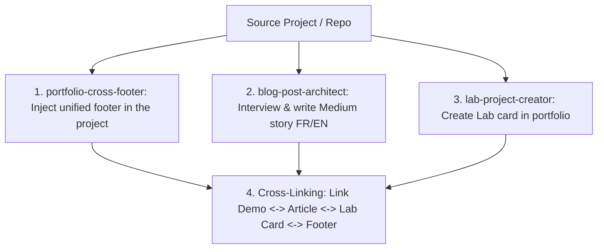

# 🌐 Project Showcase Nexus (The Trifecta Orchestrator)

The ultimate all-in-one skill to transform any side project or web app into a fully showcased, interconnected portfolio asset.

---

## 🧭 The 4-Step Showcase Pipeline

---

## 🛠️ Step-by-Step Execution:

### 1. Unified Footer Injection (`portfolio-cross-footer`)
- Injects Alexandre's clean, responsive footer into the standalone project linking to `https://alexandre-enouf.fr/`, `#lab`, and blog.

### 2. Storytelling & Blog Creation (`blog-post-architect`)
- Runs the "Sam & Max / Vibe Coding" interview.
- Generates `data/blog/<project-slug>/content/fr.md`, `content/en.md`, `images/`, and `meta.yaml`.
- Associates `project: <project-slug>`.

### 3. Lab Card Registration (`lab-project-creator`)
- Generates `data/lab/<project-slug>/meta.yaml` with stack tags, demo link, repo link, and summary.

### 4. Bidirectional Interconnection
- In the Lab `meta.yaml`: sets `links.article: "blog/<project-slug>/index.html"`.
- In the Blog `meta.yaml`: sets `project: "<project-slug>"`.
- In the Blog markdown content: embeds live demo and GitHub repo links.
- Regenerates the full portfolio distribution (`python scripts/generate_all.py && make build`).
