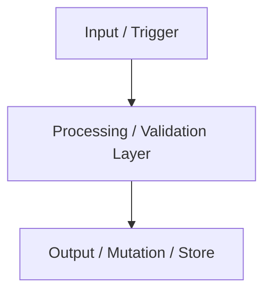

# 🏗️ Pull Request Architect Skill

Generates crystal-clear, structured Pull Requests featuring architecture diagrams and comprehensive review contexts.

---

## 🎯 PR Generation Blueprint

When opening a Pull Request via GitHub CLI (`gh pr create`) or preparing a description:

```markdown
## 🎯 Purpose & Context
[Concise executive summary of what problem this PR solves or feature it introduces]

## 🏗️ Architecture & Data Flow (Mermaid Diagram)


## 📦 Key Changes by Scope
- **`scope/component`**: Detailed rationale and key decisions.
- **`scope/tooling`**: Configuration updates.
- **`tests/`**: Test coverage additions.

## 🧪 Validation & Quality Gates
- [x] Unit tests passing (`make test` / `npm test` / `pytest`)
- [x] CI pipeline / Linters passing (`make check` / `make ci`)
- [x] Manual testing performed
```
