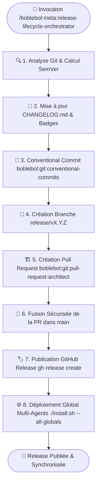

# 🚀 Méta-Skill : Release Lifecycle Orchestrator

Ce **Méta-Skill de Release & Livraison Continue** automatise à 100% l'intégralité du cycle de livraison logiciel : calcul de version SemVer, synchronisation du `CHANGELOG.md`, commits conventionnels, création de branche, ouverture de Pull Request architecturée, fusion dans `main` et publication de la GitHub Release officielle.

---

## 🏗️ Architecture & Flux d'Exécution



---

## 🧭 Les 8 Étapes du Workflow de Release

### Étape 1 : Analyse des Modifications & Calcul SemVer
L'agent analyse l'historique git depuis le dernier tag :
- **Patch (`x.x.+1`)** : Uniquement des `fix:`, `refactor:`, `perf:`, `docs:`, `chore:`.
- **Minor (`x.+1.0`)** : Au moins une nouvelle fonctionnalité (`feat:`), nouveau skill, nouvelle API.
- **Major (`+1.0.0`)** : Breaking changes (`BREAKING CHANGE:` ou `feat!:`).

---

### Étape 2 : Synchronisation du `CHANGELOG.md` & Badges
- Ajoute la section `## [X.Y.Z] - YYYY-MM-DD` selon la norme [Keep a Changelog](https://keepachangelog.com/).
- Catégorise les changements sous `### Added`, `### Changed`, `### Fixed`.
- Met à jour le badge SemVer dans le `README.md`.

---

### Étape 3 : Commits Conventionnels
Délègue à `boblebol:git:conventional-commits` pour committer les fichiers avec un message clair et formatté :
```bash
git add CHANGELOG.md README.md ...
git commit -m "docs(release): prepare vX.Y.Z release and changelog sync"
```

---

### Étape 4 : Création et Push de la Branche de Release
```bash
git checkout -b release/vX.Y.Z
git push -u origin release/vX.Y.Z
```

---

### Étape 5 : Création de la Pull Request Structurée
Délègue à `boblebol:git:pull-request-architect` pour créer la PR avec titre normé et diagramme Mermaid :
```bash
gh pr create --base main --head release/vX.Y.Z \
  --title "release(vX.Y.Z): [Résumé des nouveautés]" \
  --body "[Description structurée avec diagramme Mermaid, scopes et checklist]"
```

---

### Étape 6 : Fusion Sécurisée dans `main`
```bash
gh pr merge --merge --delete-branch
git checkout main
git pull origin main
```

---

### Étape 7 : Publication de la Release GitHub Officielle
```bash
gh release create vX.Y.Z \
  --title "vX.Y.Z — [Titre percutant de la version]" \
  --notes "[Notes de version détaillées avec catégories]"
```

---

### Étape 8 : Déploiement & Synchronisation Globale
```bash
./install.sh --all-globals
```

---

## 🛠️ Exemple d'Invocation

```bash
/boblebol:meta:release-lifecycle-orchestrator
```

**Ou en langage naturel :**
- *"Fais une release propre avec mise à jour du changelog, commit conventionnel, création de PR, merge et publication GitHub release."*
- *"Publie la nouvelle version avec `boblebol:meta:release-lifecycle-orchestrator`."*
