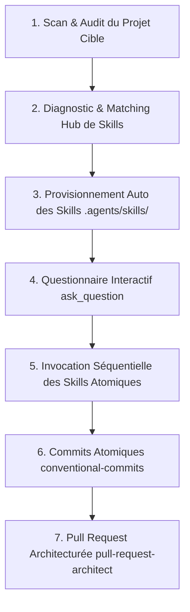

# 🪄 Méta-Skill : Repo Onboarding & Master Provisioner

Ce **Méta-Skill (Super-Skill)** orchestre l'audit complet, le provisionnement des skills modulaires, le diagnostic interactif et l'exécution automatisée des standards d'ingénierie logicielle et de production web sur tout dépôt cloné ou existant.

---

## 🧭 Workflow d'Exécution Global

---

## Phase 1: Automated Repository & Stack Audit

When invoked on a newly cloned repository or working directory, the agent performs a comprehensive read-only scan:

1. **Tech Stack Detection**:
   - Python (`pyproject.toml`, `requirements.txt`, `uv.lock`)
   - Node.js / TypeScript / React / Next.js / Vue / Astro (`package.json`, `tsconfig.json`)
   - Go / Rust / PHP / Static Generator / Other
2. **Open-Source Governance Scan**:
   - Check presence of `README.md`, `CHANGELOG.md`, `LICENSE`, `CONTRIBUTING.md`, `CODE_OF_CONDUCT.md`, `.github/PULL_REQUEST_TEMPLATE.md`, `.github/ISSUE_TEMPLATE/`.
3. **CI/CD & Lighthouse Check**:
   - Check `.github/workflows/`, `.lighthouserc.json`, Makefile / build scripts.
4. **Performance & Assets Check**:
   - Presence of unoptimized PNG/JPEG images, external CDN dependencies, missing `width`/`height` or `fetchpriority`.
5. **SEO & Metadata Check**:
   - Open Graph tags, Twitter Cards, `robots.txt`, `sitemap.xml`, missing `alt` attributes.
6. **Analytics & Privacy Check**:
   - GA4 / Plausible integration, cookieless vs cookie banner configuration.
7. **Static Pages Check**:
   - Custom 404 page, Thank You page, Mentions Légales / Privacy Policy.

---

## Phase 2: Skills Hub Matching & Local Provisioning

After identifying the repository gaps, the orchestrator:
1. Matches the missing capabilities with the **Antigravity Skills Hub** catalog (`skills/` or `~/.gemini/antigravity-cli/skills/`).
2. Automatically provisions/installs the required skills directly into the target project's `.agents/skills/` directory (using `./install.sh -p <target-path>` or direct copy).
3. Ensures that any subagent or future AI session working on the repository will have access to the exact specialized skills needed.

---

## Phase 3: Interactive Decision Questionnaire (`ask_question`)

The agent formats its findings and presents an interactive questionnaire to the user with actionable categories:

1. **Category 1 — Open-Source Standards**:
   - [ ] Set up complete README with architecture diagram, badges, and quickstart.
   - [ ] Add CHANGELOG.md (Keep a Changelog + SemVer) and CONTRIBUTING guidelines.
   - [ ] Add GitHub PR template with Mermaid diagrams and Issue templates.

2. **Category 2 — CI/CD & Lighthouse Audits**:
   - [ ] Set up Lighthouse CI automated workflow (Mobile & Desktop with 90/95 budget).
   - [ ] Add fast CI pipeline with language-specific caching.

3. **Category 3 — Web Performance & Core Web Vitals**:
   - [ ] Convert images to WebP/AVIF and fix CLS (explicit dimensions).
   - [ ] Eliminate third-party CDN latency (self-host React/Vue/vendor libraries).
   - [ ] Preload Google Fonts asynchronously without render-blocking.

4. **Category 4 — SEO & Social Previews**:
   - [ ] Add per-page metadata, Open Graph cards (`og:image`), and Twitter summary.
   - [ ] Generate `robots.txt` and `sitemap.xml`.

5. **Category 5 — Analytics & Privacy**:
   - [ ] Install GA4 in cookieless privacy-first mode (no cookie banner needed).
   - [ ] Install GA4 with custom cookie banner.
   - [ ] Add custom event tracking (`download_cv`, `click_contact`, `click_cta`).

6. **Category 6 — Static Pages**:
   - [ ] Create styled 404 error page (`noindex`).
   - [ ] Create Mentions Légales & Privacy Policy page.
   - [ ] Create Thank You / Confirmation page.

---

## Phase 4: Sequential Specialized Skill Execution

Based on user selections, the agent executes the corresponding modular skills in order:

1. **`open-source-readiness`**: Generates governance documentation, diagrams, and templates.
2. **`lighthouse-ci`**: Sets up CI workflows and budget thresholds.
3. **`web-performance`**: Optimizes assets, self-hosts vendors, and removes blocking chains.
4. **`web-seo-meta`**: Injects SEO, Open Graph, and sitemaps.
5. **`web-privacy-analytics`**: Injects analytics and sets up event tracking.
6. **`web-static-pages`**: Builds 404, legal, and confirmation pages.
7. **`conventional-commits`**: Groups and commits all changes into clean atomic commits.
8. **`pull-request-architect`**: Opens a structured Pull Request with a visual Mermaid diagram summarizing all applied upgrades.
