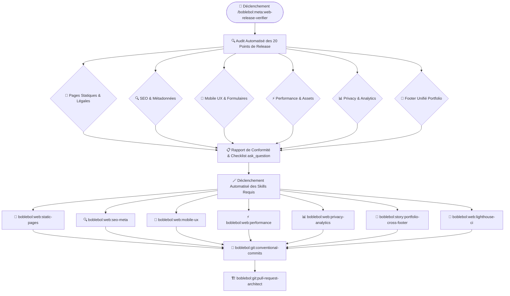

# 🚀 Méta-Skill : Web Release Verifier & Ship Checklist

Ce **Méta-Skill d'Assurance Qualité & Release Web** est l'étape obligatoire avant toute mise en ligne d'un site web, landing page ou application SaaS. Il exécute une inspection automatisée rigoureuse sur **20 points critiques de production**, présente un rapport de conformité interactif (`ask_question`), et orchestre l'application séquentielle des skills atomiques spécialisés.

---

## 🏗️ Architecture & Flux d'Exécution



---

## 📋 La Checklist Ultime des 20 Points de Production

| Catégorie | Point de Contrôle | Vérification & Exigence | Skill Délégué |
| :--- | :--- | :--- | :--- |
| **1. Pages Statiques** | **Page 404 Custom** | Présence d'une page 404 stylisée (`noindex`, lien retour accueil, layout cohérent). | `boblebol:web:static-pages` |
| | **Thank You Page** | Page de confirmation / remerciement après soumission formulaire ou paiement. | `boblebol:web:static-pages` |
| | **Privacy Policy** | Page de politique de confidentialité conforme RGPD / CNIL. | `boblebol:web:static-pages` |
| | **Terms Page (CGU)** | Conditions générales d'utilisation et mentions légales complètes. | `boblebol:web:static-pages` |
| | **Adresse Réelle Contact** | Coordonnées de contact réelles vérifiées (email, adresse physique / ville). | `boblebol:web:static-pages` |
| **2. SEO & Métas** | **Meta Title par Page** | Titre unique, explicite (50-60 caractères) avec mots-clés pertinents. | `boblebol:web:seo-meta` |
| | **Meta Description par Page** | Description attractive et percutante (140-160 caractères) par page. | `boblebol:web:seo-meta` |
| | **Open Graph Image** | Image de preview sociale (`og:image`, `twitter:image`) en 1200x630px. | `boblebol:web:seo-meta` |
| | **Favicon Set Complet** | Pack d'icônes (`favicon.ico`, `favicon.svg`, `apple-touch-icon.png`). | `boblebol:web:seo-meta` |
| | **`robots.txt`** | Fichier d'indexation valide autorisant les moteurs et pointant vers le sitemap. | `boblebol:web:seo-meta` |
| | **`sitemap.xml`** | Plan de site XML à jour avec toutes les routes indexables. | `boblebol:web:seo-meta` |
| | **Texte Alt sur Images** | Attribut `alt` descriptif et non vide sur toutes les balises ``. | `boblebol:web:seo-meta` |
| **3. Mobile & UX** | **CTA Above-the-Fold** | Bouton d'action principal immédiatement visible sans devoir scroller. | `boblebol:web:mobile-ux` |
| | **Breakpoints Mobiles** | Mise en page testée et sans overflow horizontal (360px, 390px, 414px, 768px). | `boblebol:web:mobile-ux` |
| | **Sticky Mobile CTA** | Barre d'action sticky en bas ou en haut avec backdrop-blur sur mobile. | `boblebol:web:mobile-ux` |
| | **Loading States** | États de chargement explicites (skeleton loaders, spinners sur les boutons). | `boblebol:web:mobile-ux` |
| | **Form Error States** | Messages d'erreurs accessibles (`aria-invalid`, bordures rouges, focus géré). | `boblebol:web:mobile-ux` |
| **4. Performance** | **Images Compressées** | Conversion systématique en WebP/AVIF avec `width` et `height` explicites. | `boblebol:web:performance` |
| **5. Privacy & Stats** | **Analytics & Cookie Banner**| GA4/Plausible configuré via variable d'environnement + bandeau cookies si non-cookieless. | `boblebol:web:privacy-analytics` |
| **6. Branding** | **Footer Unifié Alexandre** | Footer responsive avec les liens Portfolio, Lab, GitHub, LinkedIn, Paris, FR. | `boblebol:story:portfolio-cross-footer` |

---

## 🧭 Workflow en 4 Phases

### Phase 1 : Audit Automatisé des 20 Points
L'agent parcourt l'ensemble des fichiers HTML, templates JSX/TSX/Vue/Astro, styles CSS et configurations pour dresser le bilan exhaustif :
- **Fichiers manquants** : `404.html`, `robots.txt`, `sitemap.xml`, mentions légales.
- **Balises incomplètes** : `<title>`, `<meta name="description">`, `<meta property="og:image">`, ``.
- **Comportements UX** : Présence de boutons CTA au-dessus de la ligne de flottaison, sticky CTA mobile, squelettes de chargement.
- **Assets** : Images PNG/JPG non converties en WebP, absence de dimensions explicites (`CLS`), polices bloquantes.
- **Footer** : Présence ou absence du footer cross-site standardisé.

---

### Phase 2 : Rapport & Questionnaire Interactif (`ask_question`)
L'agent compile les points manquants et affiche un questionnaire interactif permettant à l'utilisateur de valider les actions à réaliser en 1 clic :

```text
📋 Diagnostic Web Release Verifier :
- [X] Pages Légales & 404 manquantes
- [X] SEO & Open Graph incomplets (pas d'og:image ni sitemap.xml)
- [X] 3 images sans attribut alt et au format PNG lourd
- [X] CTA mobile non sticky sur smartphone
- [X] Footer unifié Alexandre Enouf non injecté

Souhaitez-vous que j'applique l'ensemble des correctifs automatiquement ?
```

---

### Phase 3 : Déploiement Séquentiel des Skills Atomiques
Pour chaque point validé, l'orchestrateur exécute le skill spécialisé dédié :
1. `boblebol:web:static-pages` ➔ Génère la 404, page de remerciement, mentions légales et CGU.
2. `boblebol:web:seo-meta` ➔ Génère les balises metas, Open Graph, `robots.txt`, `sitemap.xml` et alts.
3. `boblebol:web:mobile-ux` ➔ Injecte le sticky header mobile, CTA above-the-fold et styles d'erreurs formulaires.
4. `boblebol:web:performance` ➔ Convertit les images en WebP, supprime les latences CDN et précharge les polices.
5. `boblebol:web:privacy-analytics` ➔ Configure le tracking RGPD / cookieless.
6. `boblebol:story:portfolio-cross-footer` ➔ Injecte le footer unifié avec styling accessible.
7. `boblebol:web:lighthouse-ci` ➔ Lance la vérification finale des scores (Perf ≥ 90, SEO/A11y ≥ 95).

---

### Phase 4 : Commits & Validation Finale
1. Regroupement des modifications en commits conventionnels avec `boblebol:git:conventional-commits`.
2. Création d'une Pull Request documentée avec le rapport de vérification complet grâce à `boblebol:git:pull-request-architect`.

---

## 🛠️ Exemple d'Invocation

```bash
/boblebol:meta:web-release-verifier
```

**Ou en langage naturel :**
- *"Vérifie tous les critères de mise en production de ma landing page avec `boblebol:meta:web-release-verifier`."*
- *"Passe la checklist de release web avant que je déploie en ligne."*
