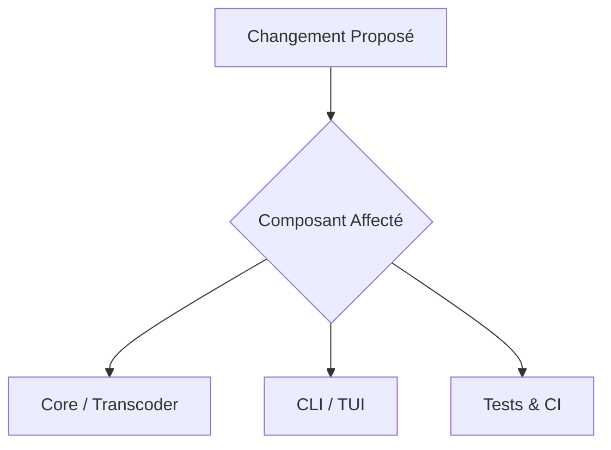

# 🚀 Pull Request: <!-- PR Title -->

## 📋 Description & Motivation
<!-- Résumé clair du problème résolu ou de la fonctionnalité apportée -->

## 🏗️ Architecture & Flux des Modifications

## 🔍 Changements Détaillés
- **Type de PR** : `feat` | `fix` | `refactor` | `perf` | `docs` | `ci` | `chore`
- **Fichiers modifiés** :
  - `file1`: description

## ✅ Checklist de Validation
- [ ] Tests unitaires exécutés avec succès (`uv run --extra dev pytest`)
- [ ] Linting et typage stricts validés (`ruff check .`, `mypy .`)
- [ ] Aucune régression sur le transcodage Apple Silicon VideoToolbox
- [ ] Documentation et `CHANGELOG.md` mis à jour si applicable
- [ ] Commits rédigés selon la convention standard (Conventional Commits)
