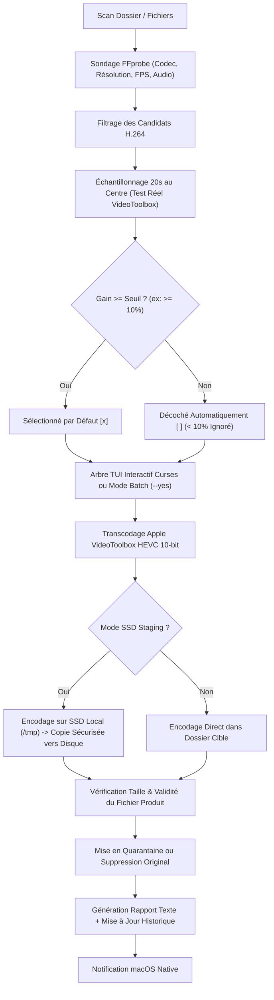

# 📚 slim-video — Guide & Documentation Complète

Bienvenue dans la documentation technique et le manuel d'utilisation complet de **`slim-video`**, le transcodeur vidéo intelligent accéléré matériellement pour macOS et Apple Silicon.

---

## 📑 Sommaire

1. [Architecture & Fonctionnement Interne](#1-architecture--fonctionnement-interne)
2. [Fidélité Audio, Vidéo & Compression](#2-fidélité-audio-vidéo--compression)
3. [Installation & Dépendances](#3-installation--dépendances)
4. [Diagnostic Matériel (`slim-video doctor`)](#4-diagnostic-matériel-slim-video-doctor)
5. [Guide des Commandes & Options CLI](#5-guide-des-commandes--options-cli)
   - [5.1 Lancement Interactif (`slim-video`)](#51-lancement-interactif-slim-video)
   - [5.2 Transcodage par Lot (`slim-video transcode`)](#52-transcodage-par-lot-slim-video-transcode)
   - [5.3 Estimation sans Modification (`slim-video estimate`)](#53-estimation-sans-modification-slim-video-estimate)
   - [5.4 Gestion de la Configuration (`slim-video config`)](#54-gestion-de-la-configuration-slim-video-config)
   - [5.5 Historique & Économies à Vie (`slim-video history`)](#55-historique--économies-à-vie-slim-video-history)
6. [Interface TUI & Navigation Clavier](#6-interface-tui--navigation-clavier)
7. [Gestion des Disques Externes & Mode SSD Staging](#7-gestion-des-disques-externes--mode-ssd-staging)
8. [Sécurité des Données, Quarantaine & Suppression](#8-sécurité-des-données-quarantaine--suppression)
9. [Automatisation, Scripts & Intégration JSON](#9-automatisation-scripts--intégration-json)
10. [Schéma de Configuration Explicite](#10-schéma-de-configuration-explicite)
11. [Dépannage & FAQ](#11-dépannage--faq)

---

## 1. Architecture & Fonctionnement Interne

`slim-video` repose sur une architecture en couches modulaires conçue pour une exécution robuste, prédictible et hautement performante sur macOS :



### Modules Clés du Codebase :
- **`slim_video.core` & `slim_video.probing`** : Découverte récursive des conteneurs vidéo (`.mp4`, `.mkv`, `.avi`, `.mov`, `.m4v`) et extraction des flux via `ffprobe`.
- **`slim_video.estimator`** : Extraction sans ré-encodage d'un extrait de 20 secondes au centre géométrique du film, compression en mémoire tampon `/tmp` et calcul précis du ratio mathématique de compression vidéo.
- **`slim_video.transcoder`** : Moteur de transcodage matériel VideoToolbox avec fallback automatique CPU (`libx265`) et garde-fous d'espace disque.
- **`slim_video.tree_selector`** : Interface TUI Curses réactive avec pliage/dépliage de dossiers et indicateurs dynamiques de gains.
- **`slim_video.workflow`** : Orchestrateur principal de traitement par lot, gestion des barres de progression Rich, reporting et alertes système.

---

## 2. Fidélité Audio, Vidéo & Compression

### 🔊 1. Préservation Audio & Pistes Multilingues (100% Bit-Exact Lossless)
- **Conservation de tous les flux (`-map 0`)** : Aucun flux n'est omis. Les pistes audio (VO, VF, audio descriptions, commentaires du réalisateur, pistes 5.1/7.1 Dolby Atmos ou DTS-HD) sont capturées intégralement.
- **Copie sans ré-encodage (`-c:a copy`)** : L'audio original n'est **jamais décompressé ni ré-encodé**. Le flux binaire original est recopié bit à bit dans le nouveau conteneur MKV sans la moindre altération acoustique.
- **Sous-titres & Chapitres (`-c:s copy`, `-map_chapters 0`, `-map_metadata 0`)** : Tous les sous-titres (SRT, ASS, PGS...) et marqueurs de chapitres sont conservés.

### 📐 2. Résolution & Fréquence d'Images
- **Aucun redimensionnement (*no downscaling*)** : Une source 1080p reste en 1080p, une source 4K reste en 4K.
- **Framerate d'origine** : Le nombre d'images par seconde d'origine (23.976 fps, 24 fps, 25 fps, 60 fps...) est conservé à l'identique.

### 🖼️ 3. Mécanique de Compression HEVC / H.265
- **Arbres de codage dynamiques (CTU)** : Le H.265 segmente l'image en blocs dynamiques de 4×4 à 64×64 pixels (contre des macroblocs rigides de 16×16 en H.264) et exploite 35 angles de prédiction intra-image (contre 9 en H.264).
- **Encodage 10-bit (`p010le`)** : Re-quantifie en 1,07 milliard de nuances de couleurs, éliminant totalement les effets d'escalier et bandes disgracieuses (*color banding*) dans les scènes sombres ou dégradés de ciel.
- **Spatial Adaptive Quantization (`-spatial_aq 1`)** : Préserve le grain cinématographique, le piqué et les micro-textures.
- **Facteur de qualité VideoToolbox 50** : Le compromis optimal assurant une transparence visuelle totale (visuellement indiscernable de l'original sur grand écran ou vidéoprojecteur).

---

## 3. Installation & Dépendances

### Prérequis Système
- **macOS** (optimisé pour Apple Silicon M1 / M2 / M3 / M4)
- **Python** ≥ 3.9
- **ffmpeg & ffprobe** avec support VideoToolbox

```bash
# Installation de ffmpeg via Homebrew
brew install ffmpeg
```

### Installation de `slim-video`

#### Option 1 : Installation globale isolée avec `uv` *(Recommandé)*
```bash
uv tool install git+https://github.com/Boblebol/slim-video.git
```

#### Option 2 : Installation pour développement local
```bash
git clone https://github.com/Boblebol/slim-video.git
cd slim-video
uv sync --all-extras --dev
```

#### Option 3 : Installation standard avec `pip`
```bash
pip install git+https://github.com/Boblebol/slim-video.git
```

---

## 4. Diagnostic Matériel (`slim-video doctor`)

La commande `doctor` valide en quelques millisecondes que votre environnement est pleinement opérationnel :

```bash
# Diagnostic complet avec benchmark d'encodage temps réel :
slim-video doctor

# Diagnostic sans benchmark (rapide) :
slim-video doctor --no-benchmark

# Export au format JSON pour monitoring / scripts :
slim-video doctor --json
```

---

## 5. Guide des Commandes & Options CLI

### 5.1 Lancement Interactif (`slim-video`)

Sans aucun argument, `slim-video` ouvre un menu interactif d'accueil permettant de :
- Choisir le dossier courant
- Saisir un chemin absolu ou relatif
- Parcourir `~/Movies` ou les volumes externes montés dans `/Volumes`
- Lancer le diagnostic système (`doctor`)
- Ouvrir l'assistant de configuration (`wizard`)
- Consulter l'historique des gains (`history`)

---

### 5.2 Transcodage par Lot (`slim-video transcode`)

```bash
# Syntaxe générale :
slim-video transcode [PATH] [OPTIONS]
# Raccourci équivalent :
slim-video [PATH] [OPTIONS]
```

#### Options disponibles :
| Option | Raccourci | Description | Valeur par défaut |
| :--- | :---: | :--- | :--- |
| `--min-gain` | `-m` | Seuil de gain minimum en % pour cocher le fichier | `10.0` |
| `--quality` | `-q` | Qualité VideoToolbox (1 à 100) | `50` |
| `--sample-seconds` | `-s` | Durée de l'échantillon de test en secondes | `20` |
| `--yes` | `-y` | Mode non-interactif : valide directement la sélection sans ouvrir la TUI | `False` |
| `--dry-run` | `-n` | Mode simulation : estime les gains et affiche le tableau sans transcoder | `False` |
| `--delete-original` | `-d` | Supprime directement l'ancien fichier au lieu de le mettre en quarantaine | `False` |
| `--ssd-staging` | | Encode temporairement sur SSD local (`/tmp/slim-video/`) | `False` |
| `--temp-dir` | | Répertoire de travail personnalisé pour `--ssd-staging` | `/tmp/slim-video` |
| `--all-codecs` | `-a` | Recherche tous les codecs non-HEVC (ex: mpeg4, msmpeg4, etc.) | `False` |
| `--no-sample-test` | | Désactive l'estimation préalable sur échantillon | `False` |
| `--json` | | Affiche les résultats au format JSON structuré | `False` |

---

### 5.3 Estimation sans Modification (`slim-video estimate`)

Affiche un tableau complet des fichiers vidéo, de leur codec actuel, de la taille estimée après passage en HEVC et du gain d'espace disque calculé.

```bash
# Estimation sur un dossier :
slim-video estimate /Volumes/Media/Films

# Estimation avec seuil personnalisé de 15% :
slim-video estimate /Volumes/Media/Films --min-gain 15

# Sortie structurée JSON :
slim-video estimate /Volumes/Media/Films --json
```

---

### 5.4 Gestion de la Configuration (`slim-video config`)

Les réglages par défaut sont enregistrés dans `~/.slim_video_config.json`.

```bash
# Lancer l'assistant pas-à-pas :
slim-video config wizard

# Afficher les réglages actifs :
slim-video config show
slim-video config show --json

# Définir un paramètre précis :
slim-video config set min_gain_percent 12.5
slim-video config set quality 48
slim-video config set delete_original true
slim-video config set ssd_staging true
slim-video config set temp_dir /tmp/my-fast-staging

# Obtenir la valeur d'un paramètre :
slim-video config get quality

# Réinitialiser aux valeurs d'usine :
slim-video config reset
```

---

### 5.5 Historique & Économies à Vie (`slim-video history`)

`slim-video` conserve un historique plafonné des sessions de transcodage pour suivre les gigaoctets économisés :

```bash
# Statistiques cumulées :
slim-video history stats
slim-video history stats --json

# Liste des 10 dernières opérations :
slim-video history

# Liste avec limite personnalisée :
slim-video history --limit 50

# Réinitialisation de l'historique :
slim-video history clear
```

---

## 6. Interface TUI & Navigation Clavier

Lorsque des fichiers candidats sont découverts, `slim-video` ouvre une interface Curses plein écran avec un arbre hiérarchique pliable :

```text
┌─ 🎬 slim-video ── H.264 Video Selection for x265 Transcoding ────────────────┐
│ 📁 Directory: /Volumes/Media/Films  (4 candidate files, 14.5 GB)             │
│──────────────────────────────────────────────────────────────────────────────│
│ [x] ▼ 📁 Action/  (2 files, 8.2 GB)                                          │
│       [x] 🎬 Matrix.mp4 [H264, 1080p] 4.0 GB → ~1.8 GB (-54.2% ✅)          │
│       [x] 🎬 Die_Hard.mkv [H264, 1080p] 4.2 GB → ~1.9 GB (-55.1% ✅)        │
│ [ ] ▼ 📁 Autres/  (2 files, 6.3 GB)                                          │
│       [ ] 🎬 Film_Compresse.mp4 [H264, 1080p] 3.0 GB → ~2.8 GB (-5.2% < min)│
│──────────────────────────────────────────────────────────────────────────────│
│ Selected: 2/4 files (8.2 GB → ~3.7 GB, Est. Gain: -54.7%)                    │
│ [↑/↓/j/k] Move  [Space] Toggle  [←/→/h/l] Fold/Unfold  [Enter] Start Transcode│
└──────────────────────────────────────────────────────────────────────────────┘
```

### Tableau des Raccourcis Clavier
| Touche(s) | Action |
| :--- | :--- |
| `↑` / `↓` ou `k` / `j` | Monter / descendre dans la liste |
| `Espace` | Cocher / décocher l'élément ou tout le dossier |
| `←` / `→` ou `h` / `l` | Plier / déplier le dossier courant |
| `e` | Déplier l'ensemble des dossiers de l'arborescence |
| `c` | Replier l'ensemble des dossiers de l'arborescence |
| `a` | Tout sélectionner / Tout désélectionner |
| `PageUp` / `PageDown` | Défilement rapide d'une page |
| `Home` / `End` / `g` / `G` | Aller au début / à la fin de la liste |
| `Entrée` | Valider la sélection et démarrer le transcodage |
| `q` ou `Echap` | Quitter sans rien modifier |

---

## 7. Gestion des Disques Externes & Mode SSD Staging

### La Problématique des Disques Durs Mécaniques Externes (HDD / WD Black)
Lorsqu'un transcodage est effectué directement sur un disque dur mécanique externe via USB :
1. FFmpeg lit la vidéo source depuis le disque mécanique.
2. Simultanément, FFmpeg écrit le flux ré-encodé sur le même disque mécanique.
3. **Résultat :** Les têtes de lecture/écriture du disque alternent en permanence entre lecture et écriture (*head-thrashing*), faisant chuter la vitesse de transcodage de 20x à moins de 2x et augmentant l'usure mécanique.

### La Solution : `--ssd-staging`
Avec `--ssd-staging` activé :
1. `slim-video` effectue une vérification préalable d'espace libre sur votre SSD interne (`/tmp` ou `--temp-dir`).
2. L'encodage s'effectue à vitesse maximale sur le SSD local (jusqu'à 30x temps réel).
3. Une fois l'encodage terminé et validé, le fichier final est transféré en écriture séquentielle continue vers le disque externe.

```bash
# Utilisation recommandée sur disque dur externe :
slim-video "/Volumes/WD_BLACK/Media/Movies" --ssd-staging --delete-original --yes
```

---

## 8. Sécurité des Données, Quarantaine & Suppression

1. **Garde-fou d'espace disque 2× :** Avant tout encodage, `slim-video` vérifie que le disque de travail dispose d'au moins 2 fois la taille du fichier source en espace libre.
2. **Quarantaine automatique (`_originals_to_delete/`) :** Par défaut, aucun fichier source n'est supprimé. Il est déplacé dans un sous-dossier de quarantaine reproduisant l'arborescence d'origine.
3. **Validation d'intégrité avant suppression :** Même avec `--delete-original`, l'original n'est supprimé **que si et seulement si** le transcodage s'est terminé avec un code retour 0 et que le fichier HEVC de destination est non vide et lisible.
4. **Nettoyage automatique des résidus :** En cas d'interruption (`Ctrl+C`), les fichiers temporaires `.tmp_*` sont nettoyés automatiquement.

---

## 9. Automatisation, Scripts & Intégration JSON

`slim-video` détecte automatiquement les contextes non-interactifs (`sys.stdin.isatty() == False`).

### Exemple d'intégration dans un script Bash
```bash
#!/usr/bin/env bash
set -euo pipefail

TARGET_DIR="/Volumes/Storage/Videos"

# Exécuter l'estimation et parser avec jq :
ESTIMATE_JSON=$(slim-video estimate "$TARGET_DIR" --json)
TOTAL_FILES=$(echo "$ESTIMATE_JSON" | jq '.total_files')

echo "Nombre de vidéos candidates trouvées : $TOTAL_FILES"

if [ "$TOTAL_FILES" -gt 0 ]; then
    echo "Démarrage du traitement par lot..."
    slim-video "$TARGET_DIR" --ssd-staging --delete-original --yes
fi
```

---

## 10. Schéma de Configuration Explicite

Exemple de contenu du fichier `~/.slim_video_config.json` :

```json
{
  "min_gain_percent": 10.0,
  "sample_duration_seconds": 20,
  "quality": 50,
  "auto_sample_test": true,
  "quarantine_dir": "_originals_to_delete",
  "delete_original": false,
  "all_codecs": false,
  "encoder": "hevc_videotoolbox",
  "ssd_staging": false,
  "temp_dir": "/tmp/slim-video"
}
```

---

## 11. Dépannage & FAQ

#### Q : Pourquoi mon fichier `.mp4` est converti en conteneur `.mkv` ?
**R :** Le format Matroska (`.mkv`) offre une compatibilité universelle supérieure pour conserver simultanément toutes les pistes de sous-titres (SRT, PGS, ASS) et tous les flux audio multicanaux (DTS-HD, Dolby Atmos, TrueHD, AAC, AC3) sans nécessiter de conversion ou de limitation de conteneur.

#### Q : Que faire si VideoToolbox n'est pas détecté par `slim-video doctor` ?
**R :** Assurez-vous d'utiliser une version native de FFmpeg pour Apple Silicon (ARM64) installée via Homebrew (`/opt/homebrew/bin/ffmpeg`). Les versions x86_64 émulées sous Rosetta ne peuvent pas accéder aux accélérateurs matériels VideoToolbox.

#### Q : Le transcodage est-il interruptible en toute sécurité ?
**R :** Oui. Un appui sur `Ctrl+C` interrompt immédiatement le processus FFmpeg en cours, supprime le fichier temporaire partiel et préserve intact le fichier source d'origine.
